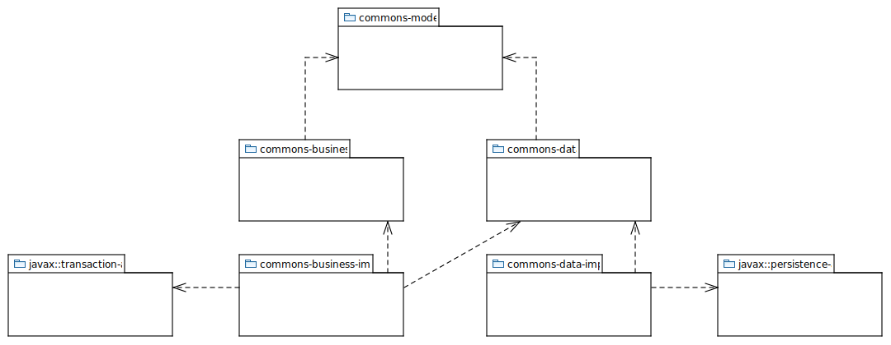
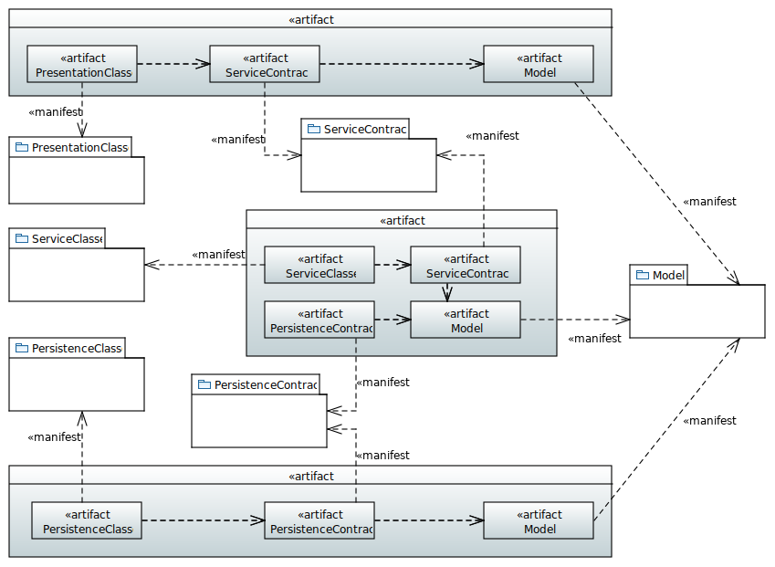
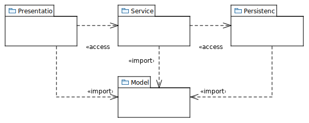

# Introduction #

There are several frameworks that help in building Enterprise Applications, some of 
them are specifically designed for creating the presentation layer, some of them 
cover the persistence layer, and then you have dependency injection frameworks that 
are the "glue" for connecting each of the layers of the system.
Most of common functionalities in enterprise application are focused on creating typical 
CRUD features. Independently of the chosen architecture, there is a lot of code that 
can be reutilized specially in backend layers. We define backend layers to be the business 
logic and persistence layers, excluding presentation. That is the reason for the creation 
of this component.
The main motivation for this component, is that whenever a new enterprise application 
is started, usually code that does the same thing is synthesized and base classes and 
interfaces are created with the same target in mind. With the advent of Java 8, mixin 
interfaces, lambda methods and method reference techniques are widely adopted and they 
can have an important impact in the amount of code needed for building this common code, 
so having it on a shared library can be a good idea.

## Scope ##
Basically we want to tackle the following use cases and conditions:

### Code re use for CRUD functionalities ###
The component should provide a set of base classes and interfaces for reducing the amount 
of boilerplate code needed for building a common CRUD functionality.

#### CRUD functionality definition ####
A CRUD functionality is basically a visual feature that will allow the user to Create 
an instance of a persistent entity, by validating user input, Read a previously persisted 
entity by searching, querying and/or listing them using a filtering technique, Update 
the state of a previously persisted entity and finally be able to Delete it from the 
persistent storage.

#### Persistent Storage definition ####
A persistent storage for enterprise application would be a relational database system 
most of the time. The component should be specially designed to work on those, but it 
should provide a good base, in the case that a different persistent storage wants to 
be used. Given that JPA is a standard designed to be a foundation to work on different 
persistence providers, relying on JPA would be a good idea. No specific dependency to 
a persistence provider should be needed. If it comes to decide which feature to be included and 
it depends on supporting NOSQL or not, always a relational database is a predominant 
choice.

#### Queries and filtering support ####
One of the most difficult things to build in a enterprise application are functionalities 
that rely on filtering persistent entities. Usually this requires a lot of boiler plate 
code, and it's rather difficult to create something "generic" without falling in a non-typed 
piggy bag that will contain values that are used for filtering.

This library should provide support for reducing the amount of code that it's needed to filter 
entities from persistent storage in a common fashion. As an example: A developer wants to 
build a CRUD functionality that contains a search screen with several fields that are going 
to be optionally populated by the user, and those values should be validated by presentation 
layer, sent as a parameter, optionally validated by the business layer, and then again sent 
as a parameter to the persistent layer, and then used to create a sort of query meant to 
retrieve the information from the persistent storage.

Without a special feature that helps on this matter, what is usually done is to create 
methods on each layer, receiving as a parameter each optional attribute, and then manually 
assembling the query in the persistent layer. This approach have the following problems:

* It works with only a small amount of parameter needed for building the query. With 
  more parameters then a class for carrying them is needed
* With a class for carrying them, then the problem that arises is that this is somehow 
  a "projection" of the persistent entity. If the entity changes in the future there 
  is no relationship between the properties of them, but they are related. As an example: 
  if a "user" entity can be filtered by first name and last name, then probably a UserFilter 
  can be created with each attribute. If then later those two attributes are merged 
  into a new attribute called "fullName" then the same modification should be done in 
  UserFilter. 
* A tool like Lombok can be used to automatically generate attributes that contain the 
  attributes names, so if there is a change, at least a compilation problem can depict 
  those problems, but also type information should be needed, so this is not the best 
  approach

A good filtering feature should be provided to be optionally used, to reduce boiler 
plate code, and problems arised by not using a strongly typed approach. 

### Non functional requirements ###

#### Regarding Java version ####
At this point of time we will focus on maximizing the usage of Java 8 language features. 
Java 8 is a required version platform to use. It is a desired feature to support newer 
java versions, but Java 8 should be supported always.

#### Class hierarchy ####
Class hierarchy should be considered as a feature that the developer using this library 
can use whenever they want. Before having mixin interfaces usually this kind of libraries 
contained base classes that provided everything needed by extending them. With default 
methods support, the same functionalities can be offered as interfaces, so the developer 
can use class hierarchy on their own, and use a certain functionality by choosing which 
interface to implement. 

#### Architecture design patterns to support ####
The most important Architecture design pattern that the component should support is 
a [Three-tier architecture](https://en.wikipedia.org/wiki/Multitier_architecture) with 
a strict separation of each module. With strict separation we mean that it should be 
possible to separate frameworks and component used in each layer. Basically we want 
to support the following:

* No persistence specific framework and libraries should be needed to import in the 
  middle layer (business logic) code.
* No business logic specific framework and libraries should be needed to import in order 
  to call exposed business logic services from presentation layer.

  
The component should provide interfaces to be used as a foundation to build contracts 
that will allow to implement the strict separation in case it's needed. Of course it
should be possible to build applications that do not need this strict separation 
as well.

Given that this stricticity is a good fit to other architecture design patterns such 
as Domain Driven Design, it would be a good outcome to support them, but it's not a 
priority.

We recognize the following separation in the code

##### Persistence layer #####
The persistence layer encloses the code needed to persist and retrieve persistent entities 
to / from a persistent storage, that it could be a Relational Database Management System 
or something else like a NoSql storage or even a remote API. A remote API could also 
be called from the business layer depending on how the remote methods are exposed. The 
main aspect we should focus on is the persistence offered by JPA, given that is a mature 
standard focused on synthesize the common methods and techniques used across several 
persistence framework like hibernate or others.
This layer is not the "most important" layer, and it should be relatively straight forward 
to write, with the exception of complex queries that are usually needed to retrive data 
from complex persistent entity database-based graphs. 
This Layer should depend on libraries and frameworks needed to persist / retrieve the 
data. But no specific dependency other that JPA should be offered as a transitive dependency 
from this component.

##### Service / Business Logic Layer #####
This layer is the most important of all of the layers, because it should contain the 
code that basically summarizes what the user wants. It is usually contains code of medium 
complexity, and it should remain even if a persistence or presentation layer migration 
is done.

It's called Business Logic Layer or Services Layer, the second mainly due to the fact 
that usually applications in a company heterogeneous environment talk to each other 
by exposing services. And usually the services that are exposed are completely written 
in this layer. Exposing presentation code is rare, and exposing persistence code is 
usually done by granting direct access to the database, or through services layer code, 
so a little bit of validation can be done (the latest form is, of course, the prefered 
way of doing it)

It usually contains:

* Business logic validation code
* Business logic calculation code
* Code that can be exported to other application as services
* Long running process
* File system access
* Mail sending process
* etc.

##### Presentation Layer #####
It is usually one of the most difficult layers to write, because of the complexity of 
writing good UIs trying to tackle all of the visual requirements of the users.
But it shouldn't be the most important layer, it should be possible to replace it so 
newer and better application visualization technologies can be used. Of course the latest 
without having a huge impact on the business logic.

This layer basically converts human interaction into information that is needed by the 
application to run a certain business logic.
Of course this conversion needs a lot of information validation that can be separated 
into the following types of it:

* Presentation / UI Validation: The first stage of validation that is needed before 
  the data can be converted in a way that it can be sent as a parameter to the services 
  that are exposed by the business logic layer. This validation is executed by the presentation 
  layer.
* Business logic validation: The second stage of validation, that is run after the data 
  is converted in a form that is recognizable by the application. This validation should always
  live in the business logic / services layer, so it can be used to validate data coming 
  from the presentation layer and data coming from other applications as well.

This layer should depend on visual frameworks and libraries needed to render the functionalities 
in a visual way to the user.

##### Model Layer #####
This is the "language" that is used by the other layers of the application total to 
each other. So basically this should contain object definitions that will allow to easily 
create a model that represent the data and behavior that the application wants to implement.
We basically identify the following kind of objects:

* Persistent Entities: These are a special kind of objects that have certain metadata 
  on them to make it easier to persist them in a persistent storage. This metadata is 
  only needed by the persistent layer, so it should not be an option to force other 
  layers to depend on a library that contains that metadata.
* DTOs: DTO stands for Data Transfer Objects, and they are usually used to transfer 
  data from presentation layer and other systems to the business logic layer

So having these two kinds of objects have a given impact on how this layer should be 
created. One option would be to create several modules, one that contains interfaces 
and the other implementations that can be used in each layer.
  
#### Layer separation approaches supported ####
Having those layer definitions in place, the following approaches should be supported 
in order of importance:

##### Three layers with contracts in separated modules #####
This approach would make it possible to build an application with the following modules:

###### Persistence Layer Contracts Module #####
This module will contain interfaces that represents the contract that the persistence 
layer will fulfill. It should not force the modules using it to import persistence technology 
specific libraries (ie: JPA).

###### Persistence Layer Implementation Module #####
This module will contain implementation of the contracts defined in the previous module. 
Commons-backend related module should offer specific persitent storage implementation 
as optional dependencies.
Objects of the model layer with persistent storage specific meta-data should live in 
this module.

###### Services Layer Contracts Module #####
This module should expose interfaces that represents the contract that the business logic 
/ services layer will fulfill. It should not force the modules using it to import specific 
technologies used to execute the offered services. As an example: it should not expose 
as a transitive dependency the persitence layer contracts module.

###### Services Layer Implementation Module #####
This module will contain implementation of the contracts defined in the previous module.

###### Model Layer Contracts Module #####
This module will contain interfaces of the objects used by the application, and given 
that it should not contain any specific technology, it can offer DTOs definition to 
be used by presentation and services layer. For not having issues when persistent entities 
are returned, always interfaces should be used for referencing them.

When we refer to modules in this approach, we are talking about separated code containers 
like Maven modules. The idea is to have a strict separation in such a way that importing 
classes of technologies used in a lower layer is not even possible.

One special thing to note is that each layer can be "connected" to the other one across 
physical connections, like exposing REST APIs.

##### Three layers in separated modules #####
This is a less strict approach than the previous one, considering only the typical three 
layers: persistence layer, services layer and presentation layer, each of those implemented
in different modules. Each of them are made up of contracts and implementations 
together.
In this case, everything can be configured in such a way that imports of persistence 
technologies are possible in the service layer, but at least not possible in the presentation 
layer (by excluding transitive dependencies or by making the persistence layer not to be
transitive).

##### Three layers in the same module #####
This is the case where all of the code is in the same code module like a java web 
application (WAR file).

Of course in this case all kinds of imports are permitted, but at least the component 
should be able to lower the amount of boiler plate code needed to write enterprise applications 
that need to organize the code in three layers

##### Hexagonal architecture / DDD #####
Given that the strict separation of layers is something that is needed and can be used 
in these kind of architectural design, a special effort should be made to support this 
scenarios. 
